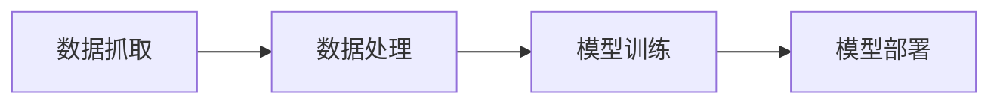
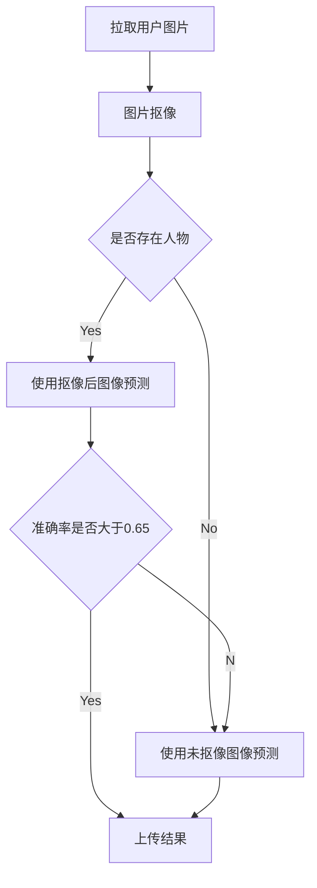

# 测测你是原神里的谁

- ## 项目简介

此项目由 ych233、Artly、善良的小坦克共同开发完成。

核心部分基于YOLOv8开发

欢迎关注作者的b站账号 ：

[ych233](https://space.bilibili.com/74110886)

也欢迎三连此项目的相关视频：

[相关视频](https://www.bilibili.com/video/BV1DN4y1d7H)

此项目大致可分为如下四步：



部署后项目的运行流程如下：


- ## 图片抓取

**本部分代码为  CatchPic.py**

在使用之前，请先配置代码中的Cookie，方法请自行查找。

```python
headers_str = {'User-Agent':ua.random,'Cookie':''} #请自行配置Cookie
```

之后请修改代码的如下部分

```python
namelist=['丘丘人'] #需要拉取的内容
n_worker=30 #开启线程数
num_max=25000 #每个关键字抓取图片数量
```

修改并运行后，图片将存储在**dataset**文件夹中

- ## 图片处理

**本部分代码为 MaskPic.py**

直接运行代码即可，抠图完成的图像将存储在**dataset_cold**文件夹中~~Artly的奇妙命名~~

运行完成后，请自行删除文件夹中的不合理图片

- ## 模型训练

**本部分代码为 SplitPic.py Train.py**

使用之前请先按照所需库

```python
pip install -r requirements.txt
```

将人工筛选完成的图片按如下格式放入**datasets**文件夹后

```
datasets
│     
└───刻晴
│   │   1.jpg
│   │   2.jpg
│   │   ...
│  
└───甘雨
    │   1.jpg
    │   2.jpg
    │   ...
```

运行**SplitPic.py**对图像进行分割

分割完成后请根据需求设置**Train.py**

```python
from ultralytics import YOLO

model = YOLO("yolo-cls/yolov8x-cls.pt")  #根据需求选择模型,见yolo官网
if __name__ == '__main__':
    model.train(data='dataset', epochs=100, batch=-1, imgsz=150) #根据需要设置参数
```

设置完成后运行即可。

- ## 模型部署

**本部分使用代码为 run.py**

您训练完成的模型将放在 

```
\runs\classify\train\weights\best.pt
```

之后修改 **run.py** 中的

```python
model = YOLO('best.pt')  #这里放权重路径
```

之后运行即可部署。

- ## 写在最后

这是我们第一次着手制作此类项目

也我第一次上传GitHub 所以有任何问题欢迎交论！

感谢！

ych233

2023.10.30
